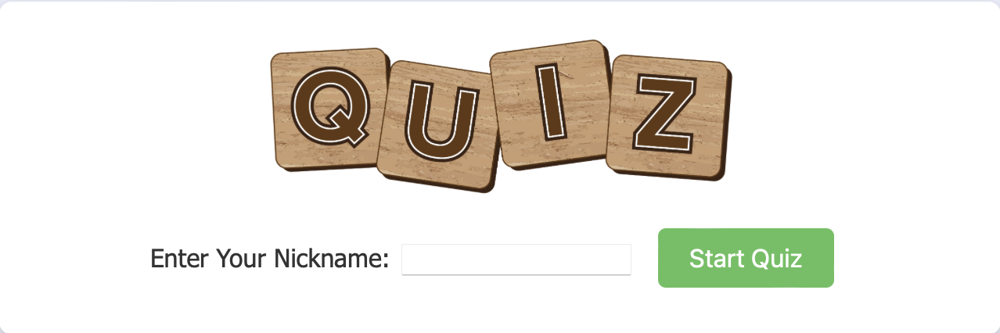
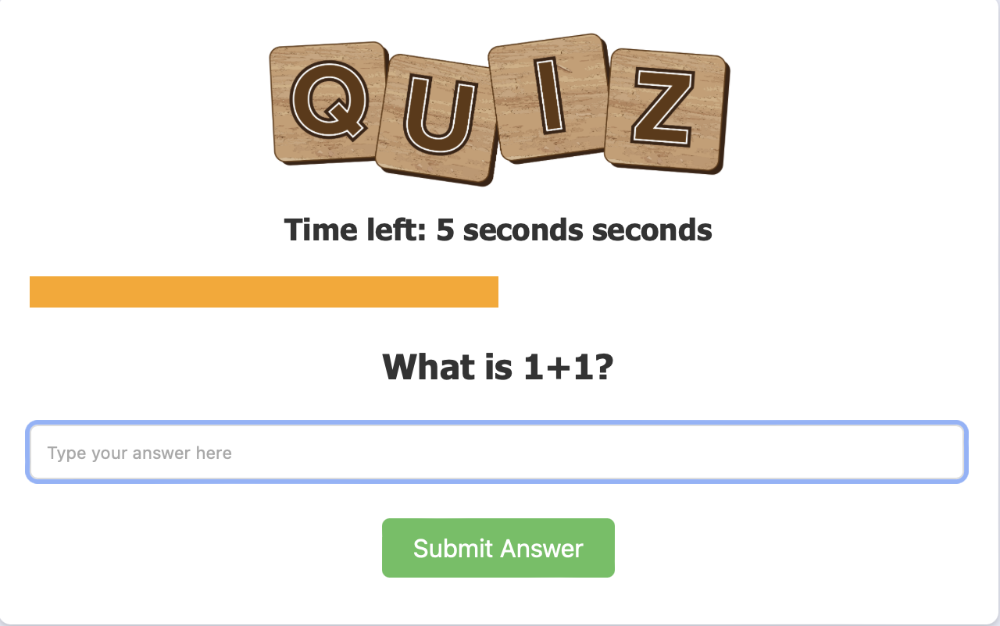
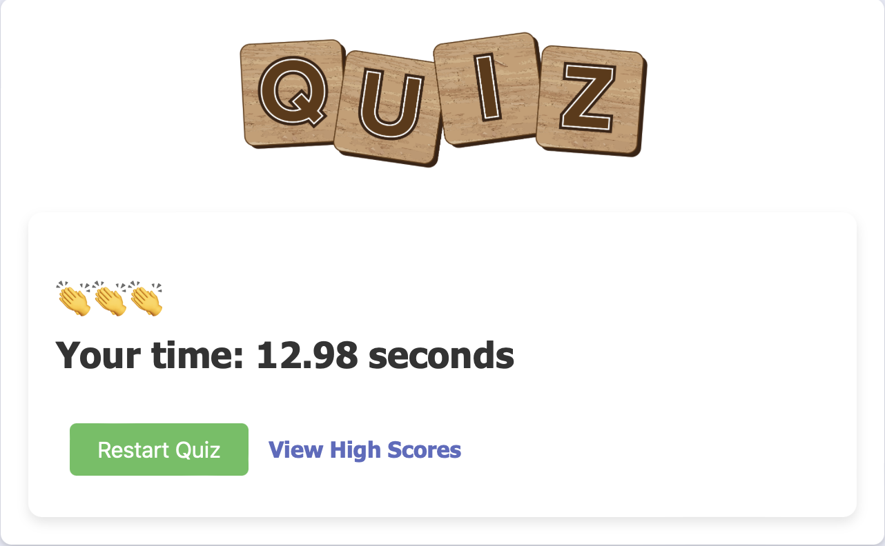
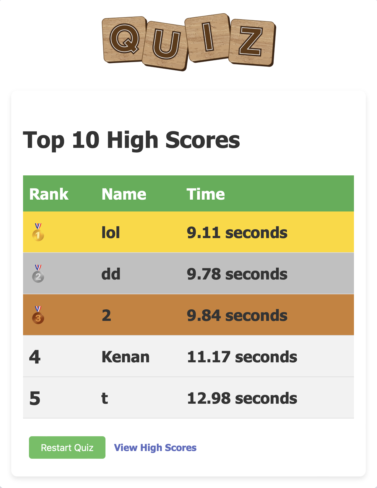

# Quiz Game

This is a single-page client application that allows users to participate in a quiz. The quiz questions are retrieved from a server using HTTP in a RESTful manner, and the user's answers are sent back to the server for validation. The game is built with JavaScript and organized using a JavaScript builder tool.

[Here](https://coursepress.lnu.se/courses/web-programming/javascript-in-the-browser/assignment) are the assignment instructions.

[Live Demo](https://km-quizapp.netlify.app)


## Screens


*Start*: This is the start screen.



*Question*: This is the question screen.



*Completed*: Shows when you are done.



*Leaderboard*: This is the leaderboard ranking

## Getting Started

To run the quiz game locally, follow these steps:

1. Clone this repository to your local machine:

   ```bash
   git clone <repository-url>
   ```

2. Install the required dependencies and development tools:

   ```bash
   npm install
   ```

3. Start the development server with live reloading:

   ```bash
   npm run dev
   ```

   You can also generate a distribution copy of your code using:

   ```bash
   npm run build
   ```

   To serve the distribution code, you can use:

   ```bash
   npm run serve
   ```

   And to start a web server for the distribution code:

   ```bash
   npm run http-server dist
   ```

4. Open your web browser and go to [http://localhost:8080](http://localhost:8080) to play the quiz game.

## How to Play

- At the start of the game, you can enter a nickname for yourself.
- You have a maximum of 10 seconds to answer each question.
- Use arrow keys to navigate and the Enter key to submit your answers.
- If you answer a question incorrectly or run out of time, the game is over.
- If you answer all questions correctly, you win and your time is displayed.

## Features

- Clear indication of wrong answers.
- Visible timer throughout the game.
- High score list accessible via a visible link.
- Playable using only the keyboard for quick gameplay.
- Aesthetically pleasing design that ensures an enjoyable user experience.

## Documentation

### Code Organization

The code for this quiz game is organized using a JavaScript builder tool. All code is located in the `src/` directory, and the distribution code is generated in the `dist/` directory.

### Asynchronous Programming

This project uses asynchronous communication to retrieve and send quiz questions and answers to the server. It demonstrates how to work with asynchronous programming in JavaScript.

### Linters and Development Tools

The project includes linters and development tools for code quality and organization. You can run linting with:

```bash
npm run lint
```

### Building and Serving

To preview the application, use:

```bash
npm run server
```

To build the distribution code, use:

```bash
npm run build
```

The distribution code can be served using the builder tool or a web server.
